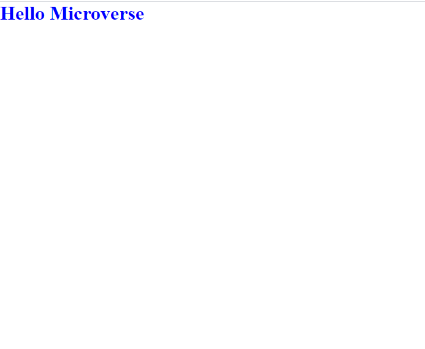

# MV-HELLO-MICROVERSE 

> This project is a Microverse exercise on linter config that demonstrates the knowledge of Linters, Github actions, Markdown, Github Workflow.

 

## Built With

- Semantic HTML
- CSS
- Markdown
- Github workflow
- [Lighthouse](https://developers.google.com/web/tools/lighthouse)
- [Stylelint](https://stylelint.io)
- [Webhint](https://webhint.io/)

## Live Preview 

[Live Demo Link]()

## Author

👤 **Abimbola**

- GitHub: [bimbolabuari](https://github.com/bimbolabuari)
- Twitter: [bimbolabuari](https://twitter.com/bimbolabuari)
- LinkedIn: [bimbolabuari](https://linkedin.com/in/bimbolabuari)

## 🤝 Contributing

Contributions, issues, and feature requests are welcome!

Feel free to check the [issues page](../../issues/).

## Show your support

Give a ⭐️ if you like this project!

## Acknowledgments

- Hat tip to anyone whose code was used
- Inspiration
- etc

## 📝 License

This project is [MIT](./MIT.md) licensed.